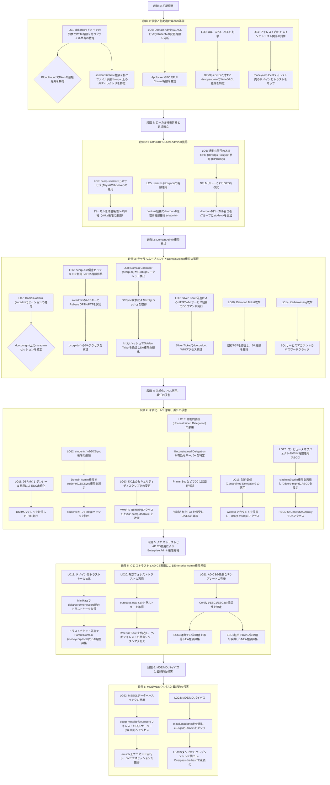

```mermaid
graph TD

    phase1[段階 1: 初期偵察]
    subgraph A[段階 1: 偵察と初期権限昇格の準備]
    direction TB
        A1[LO1: dollarcorpドメインの列挙とWrite権限を持つファイル共有の特定] --> A2{BloodHoundでDAへの最短経路を特定}
        A1 --> A3[studentxがWrite権限を持つファイル共有dcorp-ci上のAIディレクトリを特定]
        A4[LO2: Domain AdminsのACLおよびstudentxの変更権限を分析] --> A5[Applocker GPOのFull Control権限を特定]
        A6[LO3: OU、GPO、ACLの列挙] --> A7[DevOps GPOに対するdevopsadminのWriteDACL権限を特定]
        A8[LO4: フォレスト内のドメインとトラスト関係の列挙] --> A9[moneycorp.localフォレスト内のドメインとトラストをマップ]
    end
    phase1 --> A

    phase2[段階 2: ローカル特権昇格と足場確立]
    subgraph B[段階 2: FootholdからLocal Adminの獲得]
    direction TB
        B1["LO5: dcorp-studentx上のサービス(AbyssWebServer)の悪用"] --> B2[ローカル管理者権限への昇格（Write権限の悪用）]
        B3["LO5: Jenkins (dcorp-ci)の権限悪用"] --> B4["Jenkins経由でdcorp-ciの管理者権限獲得 (ciadmin)"]
        B5["LO6: 過剰な許可のあるGPO (DevOps Policy)の悪用 (GPOddity)"] --> B6[NTLMリレーによりGPOを改変]
        B6 --> B7[dcorp-ciのローカル管理者グループにstudentxを追加]
    end
    A --> phase2
    phase2 --> B

    phase3[段階 3: Domain Admin権限昇格]
    subgraph C[段階 3: ラテラルムーブメントとDomain Admin権限の獲得]
    direction TB
        C1["LO7: Domain Admin (svcadmin)セッションの特定"] --> C2{dcorp-mgmt上のsvcadminセッションを特定}
        C3[LO7: dcorp-ciの侵害セッションを利用したDA権限昇格] --> C4[svcadminのAESキーでRubeus OPTH/PTTを実行]
        C4 --> C5[dcorp-dcへのDAアクセスを検証]
        C6["LO8: Domain Controller (dcorp-dc)からkrbtgtシークレット抽出"] --> C7[DCSync攻撃によりkrbtgtハッシュを取得]
        C7 --> C8[krbtgtハッシュでGolden Ticketを偽造しDA権限永続化]
        C9[LO9: Silver Ticket偽造によるHTTP/WMIサービス経由のDCコマンド実行] --> C10[Silver Ticketでdcorp-dcへWMIアクセス検証]
        C11[LO10: Diamond Ticket攻撃] --> C12[既存TGTを修正し、DA権限を獲得]
        C13[LO14: Kerberoasting攻撃] --> C14[SQLサービスアカウントのパスワードクラック]
    end
    B --> phase3
    phase3 --> C

    phase4[段階 4: 永続化、ACL悪用、委任の侵害]
    subgraph D[段階 4: 永続化、ACL悪用、委任の侵害]
    direction TB
        D1[LO11: DSRMクレデンシャル悪用によるDC永続化] --> D2[DSRMハッシュを取得しPTHを実行]
        D3[LO12: studentxへのDCSync権限の追加] --> D4[Domain Admin権限でstudentxにDCSync権限を設定]
        D4 --> D5[studentxとしてkrbtgtハッシュを抽出]
        D6[LO13: DC上のセキュリティディスクリプタの変更] --> D7[WMI/PS Remotingアクセスのためにdcorp-dcのACLを改変]
        D8["LO15: 非制約委任 (Unconstrained Delegation) の悪用"] --> D9[Unconstrained Delegationが有効なサーバーを特定]
        D9 --> D10[Printer BugなどでDCに認証を強制]
        D10 --> D11[強制されたTGTを傍受し、DA/EAに昇格]
        D12["LO16: 制約委任 (Constrained Delegation) の悪用"] --> D13[websvcアカウントを侵害し、dcorp-mssqlにアクセス]
        D14["LO17: コンピュータオブジェクトのWrite権限悪用 (RBCD)"] --> D15[ciadminのWrite権限を悪用してdcorp-mgmtにRBCDを設定]
        D15 --> D16[RBCD S4U2self/S4U2proxyでDAアクセス]
    end
    C --> phase4
    phase4 --> D

    phase5[段階 5: クロストラストとAD CS悪用によるEnterprise Admin権限昇格]
    subgraph E[段階 5: クロストラストとAD CS悪用によるEnterprise Admin権限昇格]
    direction TB
        E1[LO18: ドメイン間トラストキーの抽出] --> E2[Mimikatzでdollarcorp/moneycorp間のトラストキーを取得]
        E2 --> E3["トラストチケット偽造でParent Domain (moneycorp.local)のEA権限昇格"]
        E4[LO20: 外部フォレストトラストの悪用] --> E5[eurocorp.localとのトラストキーを取得]
        E5 --> E6[Referral Ticketを偽造し、外部フォレストの共有リソースへアクセス]
        E7[LO21: AD CSの脆弱なテンプレートの列挙] --> E8[CertifyでESC1/ESC3の脆弱性を特定]
        E8 --> E9[ESC3経由でEA証明書を取得しEA権限昇格]
        E8 --> E10[ESC1経由でDA/EA証明書を取得しDA/EA権限昇格]
    end
    D --> phase5
    phase5 --> E

    phase6[段階 6: MDE/MDIバイパスと最終的な侵害]
    subgraph F[段階 6: MDE/MDIバイパスと最終的な侵害]
    direction TB
        F1[LO22: MSSQLデータベースリンクの悪用] --> F2["dcorp-mssqlからeurocorpフォレストのSQLサーバー(eu-sqlx)へアクセス"]
        F2 --> F3[eu-sqlx上でコマンド実行し、SYSTEMセッションを獲得]
        F4[LO23: MDE/MDIバイパス] --> F5[minidumpdotnetを使用し、eu-sqlxのLSASSをダンプ]
        F5 --> F6[LSASSダンプからクレデンシャルを抽出し、Overpass-the-hashで永続化]
    end
    E --> phase6
    phase6 --> F
```